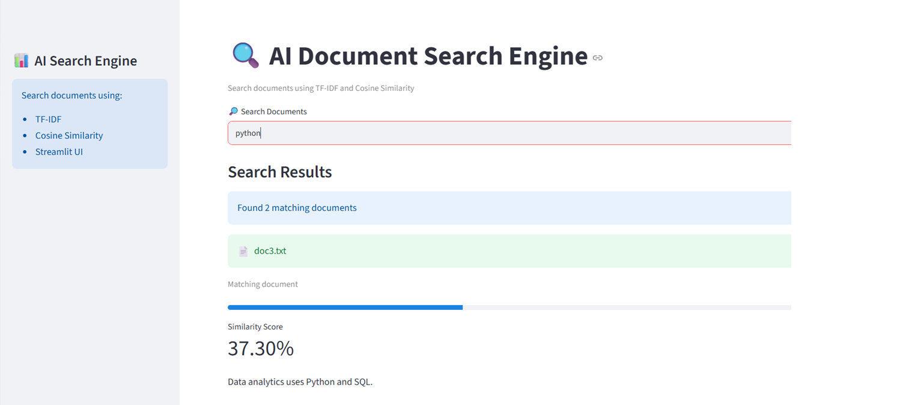

# 🔍 AI Document Search Engine

An AI-powered document search engine built using Python, Streamlit, TF-IDF Vectorization, and Cosine Similarity.

## Features

- Search across text documents
- Search PDF documents
- TF-IDF based indexing
- Cosine Similarity ranking
- Streamlit web interface
- Fast document retrieval

## Technologies Used

- Python
- Streamlit
- Scikit-learn
- PyPDF
- NumPy

## Project Structure

```
SearchEngine/
│
├── documents/
├── pdfs/
├── app.py
├── indexer.py
├── search.py
├── requirements.txt
└── README.md
```

## How to Run

```bash
pip install -r requirements.txt
streamlit run app.py
```

## Screenshot

